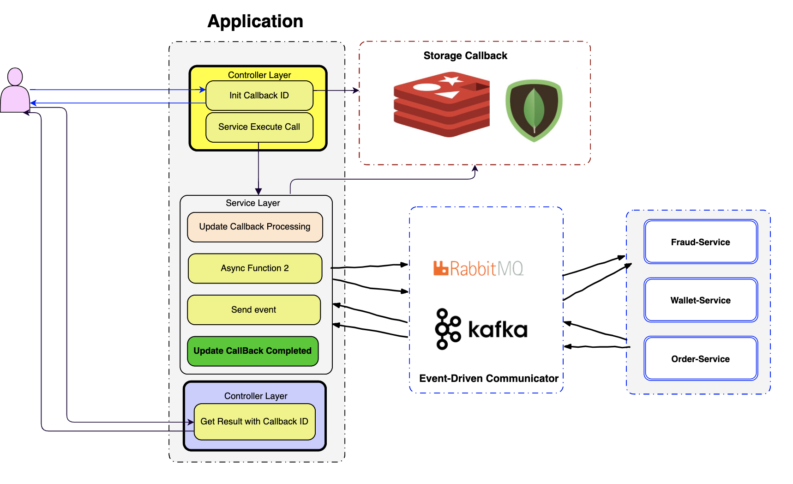
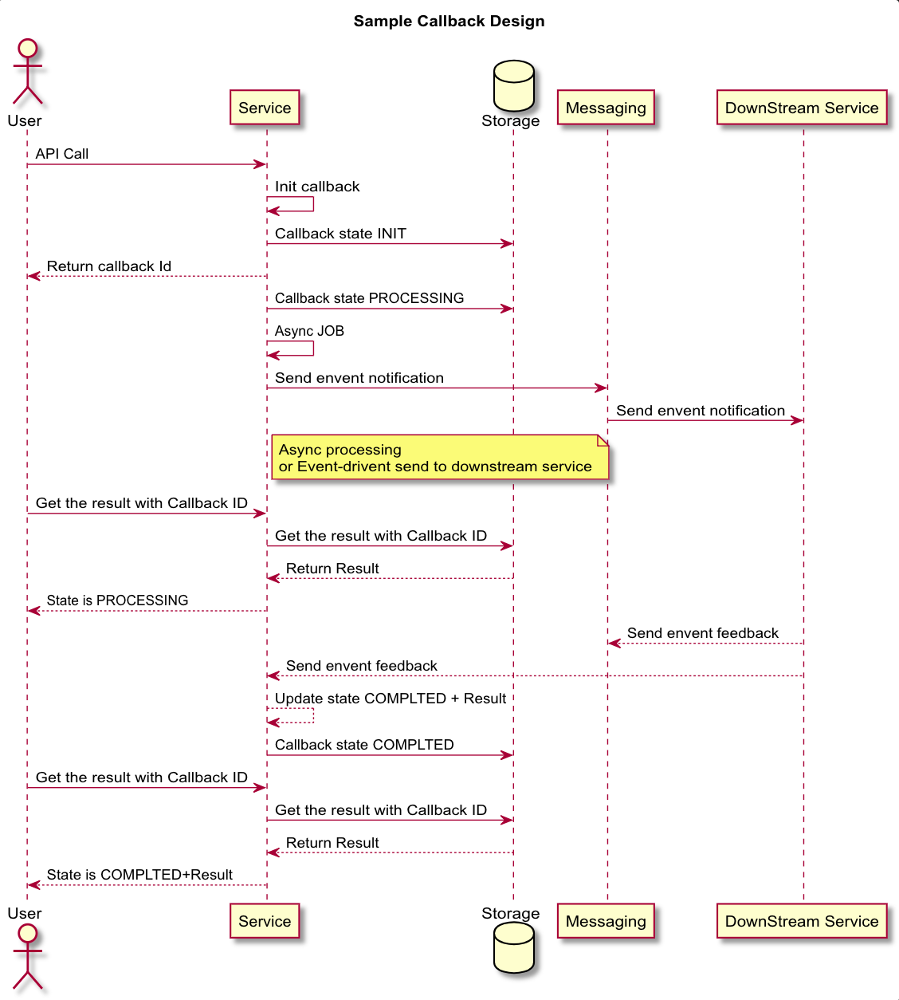

# Callback and Async Sample Solution Design
## Overview

Build the API for scale and reliable might need a lot of things required such as Deployment Process
that be able to scale, failover, Non-Blocking I/O framework, Messaging, Event-driven architecture etc.

Sometime you need to increase amount of CPU/RAM to enable scale or deploy copy of replicas if you are using containerization.
However if you build your API using Blocking IO, when the clients request thousand per second your API will be got pressure
and your system failure was increasing.

If your service call to downstream services by http protocol you're blocking process, network latency is increasing.
* How we improve this process more reliable, async way and adopt with event-driven messaging?
Let's take a look a sample design below.



## Quick Introduce Design
Example you have an API call **Payment API** that provide the customer to do the payment.

Basically instead provides the clients waits until a whole process completed and response back.
We just need to init callback id and return a callback id that tell to the clients, please callback to get your result.

What are the benefits for doing this?

* **Make the system more reliable and robust**
* **We can execute the process asynchronously and finally you just need to update the state**.

example: 
```java
    public CompletableFuture<StackOverflowTagList> fetchTagsFromStackOverFlow(String userId) throws Exception {

        log.info("Fetching StackOverflow tags using RestTemplate+CompletableFuture with user id:{}", userId);
        CompletableFuture<StackOverflowTagList> stackOverflowTagResponse =
                CompletableFuture.supplyAsync(() -> restTemplate.getForObject(urlBuilder.fullApiEndpoint(userId),
                        StackOverflowTagList.class));
        log.info("StackOverflow tags of user id:{} is done:{}",
                userId, stackOverflowTagResponse.isDone());
        return stackOverflowTagResponse;

    }

    public CompletableFuture<StackOverflowTagList> processBusinessLogic(String callbackId) throws Exception{

        CompletableFuture<StackOverflowTagList> result = fetchTagsFromStackOverFlow(callbackId)
                .thenApplyAsync(stackOverflowTagList -> {
                    return applyMyBusinessLogic(stackOverflowTagList);
                });
        return result;
    }
    public void execute(String userId, String callBackId) throws Exception {

        taskCallbackStorageWorker.processing(callBackId);
        processBusinessLogic(userId)
                .thenAcceptAsync(stackOverflowTagList ->
                    taskCallbackStorageWorker.completed(callBackId, stackOverflowTagList)
                );
    }

```
*By doing this all the process are asynchronous.*

* **We can adopt with event-driven more easily and scale**. 

If we have a lot of downstream services, we just 
need to send all the events we need to them to perform through broker like RabbitMQ, ApacheKafka.
 
When the downstream services completed, they just need send back the result.
Then we just need to update the state. 

Example: you have two downstream services independent call, you can send the event asynchronously.

* **Easy to trace the event, state and result**

We can find any state and the result include the details like the root cause and the client can get the result whenever they want.

They just need the callback id. It might be useful for reporting and reconciliation or settle.


All the result with state are storing in memory by default for my design. 

We can just store it whatever that we want. It might be good for **Redis** memory data store or NoSQL for index searching with well document store.

